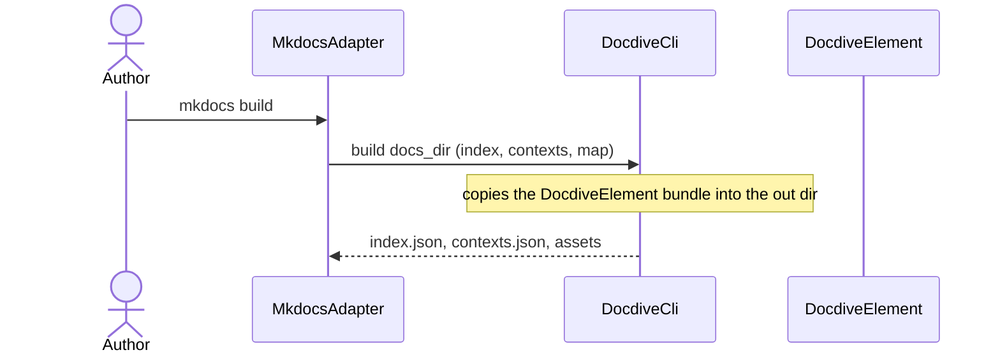

# Scenario: build-time indexing

The SSG build triggers docdive, which produces the model and browser assets.

```mermaid
sequenceDiagram
  actor Author
  participant MkdocsAdapter
  participant DocdiveCli
  participant DocdiveElement
  Author->>MkdocsAdapter: mkdocs build
  MkdocsAdapter->>DocdiveCli: build docs_dir (index, contexts, map)
  Note over DocdiveCli: copies the DocdiveElement bundle into the out dir
  DocdiveCli-->>MkdocsAdapter: index.json, contexts.json, assets
```
