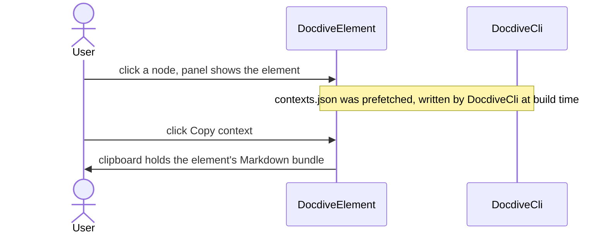

# Scenario: copy an element's context

A reader clicks a node and copies its agent-ready context.

```mermaid
sequenceDiagram
  actor User
  participant DocdiveElement
  participant DocdiveCli
  User->>DocdiveElement: click a node, panel shows the element
  Note over DocdiveElement,DocdiveCli: contexts.json was prefetched, written by DocdiveCli at build time
  User->>DocdiveElement: click Copy context
  DocdiveElement->>User: clipboard holds the element's Markdown bundle
```
