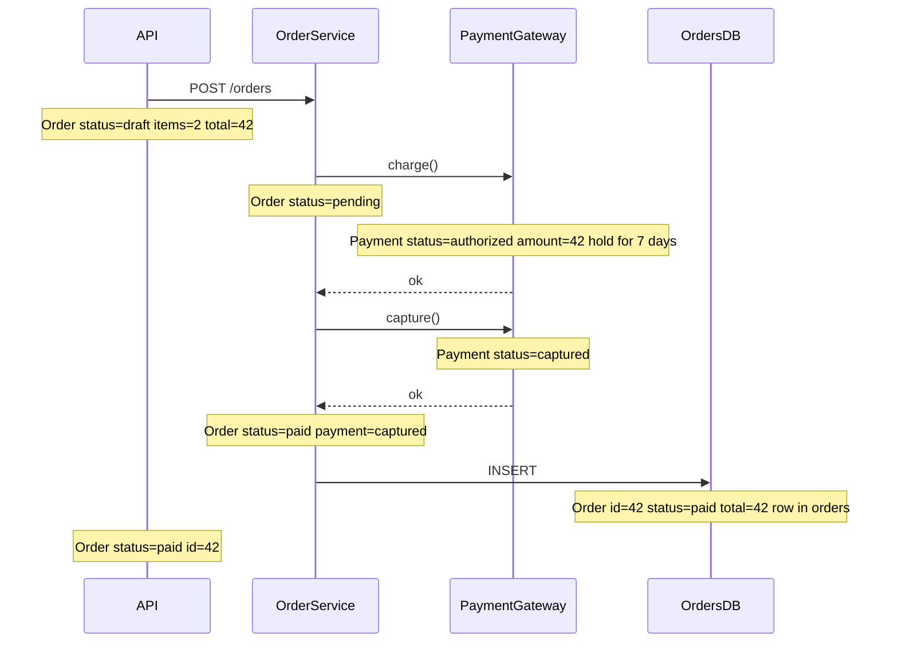

```mermaid
sequenceDiagram
  API->>OrderService: POST /orders
  Note over API: Order status=draft items=2 total=42
  OrderService->>PaymentGateway: charge()
  Note over OrderService: Order status=pending
  Note over PaymentGateway: Payment status=authorized amount=42 hold for 7 days
  PaymentGateway-->>OrderService: ok
  OrderService->>PaymentGateway: capture()
  Note over PaymentGateway: Payment status=captured
  PaymentGateway-->>OrderService: ok
  Note over OrderService: Order status=paid payment=captured
  OrderService->>OrdersDB: INSERT
  Note over OrdersDB: Order id=42 status=paid total=42 row in orders
  Note over API: Order status=paid id=42
```
